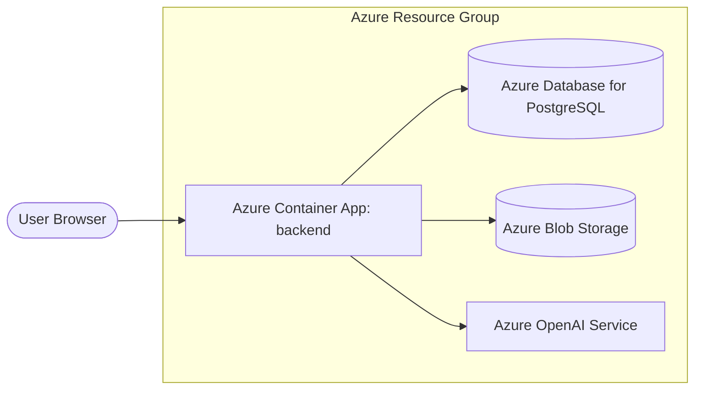

# Azure Container Apps Cloud Deployment Runbook

This guide describes how to deploy the Dolphin Consulting AI Search application backend to **Azure Container Apps** (ACA) and connect it to existing resources (Azure Database for PostgreSQL Flexible Server and Storage Account).

---

## 1. Prerequisites & Topology

The deployment assumes the following resources are already created:
1. **Azure Database for PostgreSQL (Flexible Server)**: Active, containing the `dolphin_ai_search` database.
2. **Azure Storage Account**: Active, containing the `dolphin-originals` container.
3. **Azure OpenAI Resource**: Deployments for embeddings (`text-embedding-3-large`) and classification (`gpt-5.4-mini`).



---

## 2. Step-by-Step Deployment Guide

Ensure you have the Azure CLI installed and are logged in:
```bash
az login
az account set --subscription "<your-subscription-name-or-id>"
```

### Step 1: Create Container Registry (ACR)
Create an Azure Container Registry to host the docker images:
```bash
az acr create \
  --resource-group dolphin-search-rg \
  --name dolphinacr \
  --sku Basic \
  --admin-enabled true
```

Get registry credentials:
```bash
az acr credential show --name dolphinacr
```

### Step 2: Build and Push Docker Image
Create a `Dockerfile` in the root of the project:
```dockerfile
FROM python:3.11-slim

WORKDIR /app

# Install system dependencies
RUN apt-get update && apt-get install -y --no-install-recommends \
    build-essential \
    libpq-dev \
    && rm -rf /lib/apt/lists/*

COPY requirements.txt .
RUN pip install --no-cache-dir -r requirements.txt

COPY . .

EXPOSE 8000

CMD ["uvicorn", "app.main:app", "--host", "0.0.0.0", "--port", "8000"]
```

Build and push the docker image to your registry:
```bash
# Log in to ACR
az acr login --name dolphinacr

# Build image
docker build -t dolphinacr.azurecr.io/ai-search-backend:v1.0.0 .

# Push image
docker push dolphinacr.azurecr.io/ai-search-backend:v1.0.0
```

### Step 3: Create Container App Environment
Create the Log Analytics workspace and Container App Environment:
```bash
az containerapp env create \
  --resource-group dolphin-search-rg \
  --name dolphin-env \
  --location westeurope
```

### Step 4: Deploy Container App
Deploy the container to Azure Container Apps, exposing port 8000:
```bash
az containerapp create \
  --resource-group dolphin-search-rg \
  --name dolphin-search-backend \
  --environment dolphin-env \
  --image dolphinacr.azurecr.io/ai-search-backend:v1.0.0 \
  --target-port 8000 \
  --ingress external \
  --min-replicas 1 \
  --max-replicas 3 \
  --registry-server dolphinacr.azurecr.io
```

### Step 5: Configure Environment Variables & Secrets
Configure environmental secrets for database credentials and Azure OpenAI connection strings:

```bash
# Set backend secrets
az containerapp secret set \
  --resource-group dolphin-search-rg \
  --name dolphin-search-backend \
  --secrets \
    db-password="<your-postgres-password>" \
    openai-key="<your-azure-openai-key>"

# Bind secrets to environment variables
az containerapp update \
  --resource-group dolphin-search-rg \
  --name dolphin-search-backend \
  --set-env-vars \
    APP_ENV="production" \
    POSTGRES_HOST="<your-postgres-host>.postgres.database.azure.com" \
    POSTGRES_PORT="5432" \
    POSTGRES_DB="dolphin_ai_search" \
    POSTGRES_USER="<your-postgres-username>" \
    POSTGRES_PASSWORD=secretref:db-password \
    POSTGRES_SSLMODE="require" \
    AZURE_OPENAI_ENDPOINT="https://<your-openai-endpoint>.openai.azure.com/" \
    AZURE_OPENAI_API_KEY=secretref:openai-key \
    AZURE_OPENAI_FLASH_DEPLOYMENT="gpt-5.4-mini" \
    AZURE_OPENAI_THINKING_DEPLOYMENT="gpt-5.4-mini" \
    AZURE_OPENAI_EMBEDDING_DEPLOYMENT="text-embedding-3-large" \
    AZURE_STORAGE_ACCOUNT="<your-storage-account-name>" \
    AZURE_STORAGE_CONNECTION_STRING="<your-storage-connection-string>" \
    AZURE_BLOB_CONTAINER_ORIGINALS="dolphin-originals"
```

---

## 3. Operations & Troubleshooting

### Ingress & CORS settings
If your frontend Next.js container (deployed separately or run locally) communicates with this backend, you must enable CORS on Container Apps:
```bash
# Allow origins
az containerapp ingress cors update \
  --resource-group dolphin-search-rg \
  --name dolphin-search-backend \
  --allowed-origins "*" \
  --allowed-methods "GET,POST,OPTIONS" \
  --allowed-headers "*" \
  --allow-credentials true
```

### View Live Logs
To stream stdout/stderr logs from the running Container App instance:
```bash
az containerapp logs show \
  --resource-group dolphin-search-rg \
  --name dolphin-search-backend \
  --follow
```
