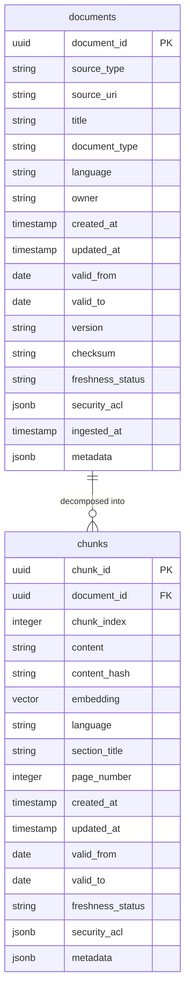

# Database Schema & Metadata Specification

This document provides a conceptual and structural overview of the database schema for the AI Search Application. The database is hosted on Azure Database for PostgreSQL Flexible Server, utilizing the `vector` (pgvector) and `uuid-ossp` extensions.

---

## 1. High-Level Database Relationship Model

The system uses a simple parent-child relational model to map imported corporate documents to their decomposed search segments (chunks):



---

## 2. Table Specifications

### A. Table: `documents`
This table holds document-level metadata, tracking parent file properties, versioning, and access lists.

| Column | Datatype | Constraints | Default | Description |
| :--- | :--- | :--- | :--- | :--- |
| `document_id` | `UUID` | Primary Key | `uuid_generate_v4()` | Unique identifier for the parent document. |
| `source_type` | `VARCHAR` | NOT NULL | - | Location source type (e.g., `'local'`, `'azure_blob'`). |
| `source_uri` | `VARCHAR` | NOT NULL | - | The URI pointing to the file (e.g., `file://data/R_399.pdf`). |
| `title` | `VARCHAR` | NOT NULL | - | The visual title of the document (e.g., `'Opatření rektora R_399'`). |
| `document_type` | `VARCHAR` | NOT NULL | - | The category of the file (e.g., `'policy'`, `'document'`). |
| `language` | `VARCHAR` | - | `'en'` | Default language configuration (e.g., `'cs'` for Czech). |
| `owner` | `VARCHAR` | Nullable | - | Owner or department responsible for the file. |
| `created_at` | `TIMESTAMP` | NOT NULL | `utcnow()` | The creation timestamp of the record. |
| `updated_at` | `TIMESTAMP` | NOT NULL | `utcnow()` | The last modification timestamp of the record. |
| `valid_from` | `DATE` | Nullable | - | Operational start date of the document rules. |
| `valid_to` | `DATE` | Nullable | - | Operational expiration date of the document rules. |
| `version` | `VARCHAR` | Nullable | - | Document version string (e.g., `'1.0'`). |
| `checksum` | `VARCHAR` | Nullable | - | MD5 or SHA256 checksum used to check for ingestion updates. |
| `freshness_status`| `VARCHAR` | NOT NULL | `'current'` | Validity status flag (e.g., `'current'`, `'archived'`). |
| `security_acl` | `JSONB` | Nullable | - | Document access control list (groups permitted to view). |
| `ingested_at` | `TIMESTAMP` | NOT NULL | `utcnow()` | The timestamp indicating when ingestion occurred. |
| `metadata` | `JSONB` | Nullable | - | Custom key-value dictionary for dynamic metadata attributes. |

---

### B. Table: `chunks`
This table holds the individual parsed text segments (paragraphs or overlapping windows), their calculated vectors, and segment-level access metadata.

| Column | Datatype | Constraints | Default | Description |
| :--- | :--- | :--- | :--- | :--- |
| `chunk_id` | `UUID` | Primary Key | `uuid_generate_v4()` | Unique identifier for the chunk. |
| `document_id` | `UUID` | Foreign Key (ON DELETE CASCADE) | - | References `documents.document_id`. |
| `chunk_index` | `INTEGER` | NOT NULL | - | The zero-based sequence position of the chunk in the file. |
| `content` | `TEXT` | NOT NULL | - | The actual parsed text segment content (max 800 chars). |
| `content_hash` | `VARCHAR` | Nullable | - | Hash of the content text to check for duplication. |
| `embedding` | `VECTOR(1536)`| Nullable | - | pgvector vector array containing the 1536-dimensional semantic representation. |
| `language` | `VARCHAR` | - | `'en'` | Stemming configuration language code (e.g., `'cs'`). |
| `section_title` | `VARCHAR` | Nullable | - | The name of the PDF section/chapter where the text resided. |
| `page_number` | `INTEGER` | Nullable | - | The 1-based page number within the original PDF. |
| `created_at` | `TIMESTAMP` | NOT NULL | `utcnow()` | The creation timestamp of the record. |
| `updated_at` | `TIMESTAMP` | NOT NULL | `utcnow()` | The last modification timestamp of the record. |
| `valid_from` | `DATE` | Nullable | - | Start date of chunk validity. |
| `valid_to` | `DATE` | Nullable | - | Expiration date of chunk validity. |
| `freshness_status`| `VARCHAR` | NOT NULL | `'current'` | Validation flag matching the parent document's freshness. |
| `security_acl` | `JSONB` | Nullable | - | Access control lists for granular segment security permissions. |
| `metadata` | `JSONB` | Nullable | - | Merged custom metadata tags copied from the parent document. |

---

## 3. Database Indexes

To support rapid keyword and similarity retrieval over millions of records, the following index structures are compiled on the data layers:

1. **Primary Key Indexes**:
   - `documents_pkey` on `documents(document_id)` (B-Tree).
   - `chunks_pkey` on `chunks(chunk_id)` (B-Tree).
2. **Foreign Key index**:
   - Explicit constraint maps `chunks.document_id` to `documents.document_id` with cascade options to clean chunks automatically on document removals.
3. **Full-Text Search (FTS) Index**:
   - **Name**: `chunks_fts_idx`
   - **Type**: `GIN` (Generalized Inverted Index)
   - **Statement**: `CREATE INDEX chunks_fts_idx ON chunks USING gin(to_tsvector('cs', content));`
   - **Behavior**: Built dynamically using the Czech configuration `'cs'` if present on the host environment; falls back gracefully to `'simple'` if stemming files are missing, ensuring seamless local development.

---

## 4. Metadata JSONB Schema Definitions

### A. Access Control Lists (`security_acl`)
Granular security constraints are declared on the JSONB columns utilizing array structures:

```json
{
  "allowed_groups": [
    "HR",
    "Finance",
    "Engineering",
    "Public"
  ]
}
```
* **Retrieval Evaluation**: Chunks are returned to the user only if there is a match between the user's Entra ID group membership list and the allowed groups listed in `security_acl.allowed_groups`.

### B. Custom Metadata (`metadata` Column)
The dynamic JSONB columns store variable key-value tags used to refine vector searches via filters. Common attributes include:

```json
{
  "department": "HR",
  "year": "2026",
  "author": "Rektorát JU",
  "original_filename": "R_399_registr_smluv.pdf"
}
```
* **Dynamic Query Filters**: If a search request specifies a metadata filter (e.g. `{"department": "HR"}`), SQL statements query the column directly via `metadata ->> 'department' = :val` to prune irrelevant chunks before running semantic comparisons.
