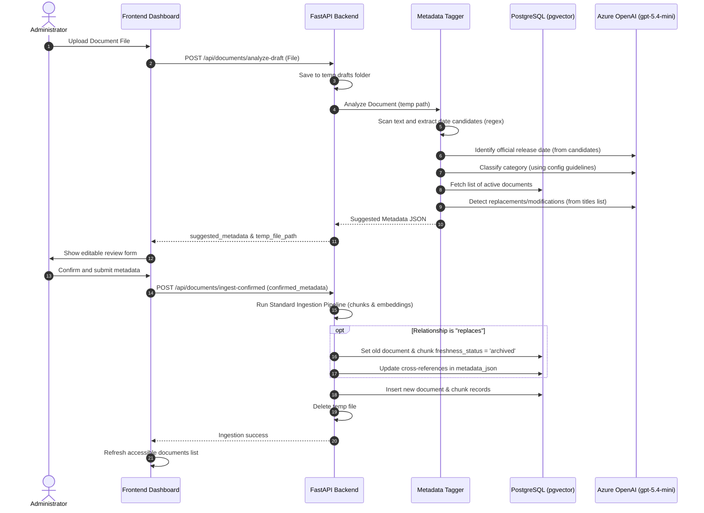

# Metadata Auto-Tagging & Archival Relationship System Design

This document details the architecture, data structures, and algorithms for Slice 1: **Automatic Tagging & Ingestion API/UI** and Slice 2: **Cloud Container Deployment**.

---

## 1. System Overview

The system automates the process of tagging newly uploaded PDF and TXT documents. Instead of asking administrators to manually inspect documents and type in metadata details (title, release date, security access control groups, and relationship links to other documents), an LLM parses the content of the document and suggests these values automatically.

The administrator can then review, correct, or supplement the suggestions through a web-based form before confirming the final ingestion into PostgreSQL.

### Key Requirements
- **Automated Category Classification**: Uses an LLM to categorize documents (e.g. `Management`, `HR`, `Finance`, `User`).
- **Dynamic Configuration**: The categories, descriptions, and AI guidelines must be completely editable in the system.
- **Release Date Extraction**: Finds candidate dates in document text, submits them to the LLM to identify the official date of issue, and falls back to file/metadata dates if not found.
- **Replacement / Modification Links**: Automatically detects whether a document replaces or modifies an existing document. Replaced documents must be archived and hidden from "current only" queries.
- **Backward Compatibility**: Highlighting and standard chunking pipelines must remain unbroken.

---

## 2. Ingestion & Analysis Flow



---

## 3. Component Details

### A. Dynamic Config Schema: `classification_config.json`
To support dynamic readjustments (e.g., swapping HR for DevOps), the configuration is stored in `app/core/classification_config.json`:

```json
{
  "categories": [
    {
      "key": "Management",
      "label": "Vedení (Management)",
      "description": "Dokumenty určené pouze pro vedení společnosti, strategická rozhodnutí, plány a interní dohody vedení.",
      "allowed_groups": ["Management"]
    },
    {
      "key": "HR",
      "label": "Personální (HR)",
      "description": "Dokumenty týkající se lidských zdrojů, náboru, benefitů, dovolených a vnitřního chodu týmu.",
      "allowed_groups": ["Management", "HR"]
    },
    {
      "key": "Finance",
      "label": "Finanční (Finance)",
      "description": "Dokumenty spojené s účetnictvím, auditem, rozpočty, fakturací a finančními procesy.",
      "allowed_groups": ["Management", "Finance"]
    },
    {
      "key": "User",
      "label": "Zaměstnanecké (User / Public)",
      "description": "Obecné směrnice, návody a informace přístupné pro všechny zaměstnance.",
      "allowed_groups": ["Management", "HR", "Finance", "User"]
    }
  ],
  "analysis_rules": "Zaměř se na vyhledávání oficiálních názvů, legislativních odkazů, čísel směrnic a typických korporátních schvalovacích formulí."
}
```

- When `GET /api/documents/categories` is called, it returns this config.
- When `POST /api/documents/categories` is submitted, it overwrites the file.
- The frontend role switcher dropdown and allowed groups arrays are drawn directly from the `categories` array.

### B. Release Date Extractor
Document release dates are determined in three steps:
1. **Regex Scan**: Searches for date patterns:
   - `DD.MM.YYYY` or `D.M.YYYY` (e.g. `24.12.2026`, `5. 5. 2026`)
   - `YYYY-MM-DD` (e.g. `2026-06-11`)
   - Czech written months (e.g. `15. ledna 2026`)
2. **Context Selection**: Extracts the text line containing the date and 3 lines above and below to form a candidate snippet.
3. **LLM Decision**: The candidate snippets are sent to `gpt-5.4-mini` with the system prompt:
   *"Urči z následujících fragmentů oficiální datum vydání či účinnosti dokumentu. Odpověz pouze ve formátu YYYY-MM-DD nebo null."*
4. **Fallback**: If no dates are found in the text or the LLM returns `null`, the system reads the PDF file creation metadata date. If that is also missing, it falls back to the current date.

### C. Relationship Archival Workflow
During confirmation, if a document replaces another:
1. The backend updates the target document's `freshness_status` to `"archived"`.
2. All chunks linked to the target document are also updated to `freshness_status = "archived"`.
3. In standard vector searches with the freshness filter set to `"latest"`, the SQL query skips any chunks where `freshness_status != "current"`.
4. The new document's `metadata_json` stores:
   `{"replaces_document_id": "uuid-here", "replaces_document_title": "title-here"}`
5. The old document's `metadata_json` stores:
   `{"replaced_by_document_id": "uuid-here", "replaced_by_document_title": "title-here"}`

This cross-referencing maintains auditable tracking of replaced files.

---

## 4. Preservation of Highlighting Pipeline

The standard ingestion flow maps text coordinates line-by-line to enable exact chunk highlighting on the frontend client. To prevent breaking this:
- The temporary file uploaded for `/analyze-draft` is not chunked. Only text extraction is run for LLM analysis.
- Once confirmed, the file is passed into `IngestionPipeline.ingest_file`, which preserves the original character-mapping and PDF page-by-page ingestion code verbatim.
- The coordinates and original text structure remain unmodified in the `chunks` database table, ensuring that the PyMuPDF highlighting endpoint (`/api/documents/view/{document_id}?highlight_chunk_id=...`) works perfectly.

---

## 5. Subfolder Ingestion & Data Source UI Filtering

### A. Subfolder Path Extraction
During folder scanning (via `os.walk` in `list_local_files`), documents are retrieved from arbitrary subdirectories under `data/`. For each file, the system computes the directory path relative to the root `data/` folder:
* **Calculation**: `rel_dir = os.path.relpath(os.path.dirname(file_path), data_dir)`
* **Ignored Root**: If the document resides directly in the root `data/` folder, `rel_dir` evaluates to `"."` and no data source metadata is written.
* **Tag Injection**: For files inside subdirectories, the relative path (with unified forward-slashes `/`) is written under keys `"source_folder"` and `"Zdroj dat"` inside the `metadata_json` dictionary.

### B. Prevention of Namespace Collisions
To allow files with identical names to exist across different subfolders without overwriting each other or throwing database uniqueness errors:
* **source_uri resolution**: The `source_uri` column is saved using the relative path rather than just the basename: `file://{relative_path}` (e.g. `file://1. ŘÍDÍCÍ DOKUMENT 0 + TP/Traumaplán.pdf`).
* **Azure Blob Key**: Uploaded blobs preserve this directory structure as a virtual path within the blob container (e.g. `1. ŘÍDÍCÍ DOKUMENT 0 + TP/Traumaplán.pdf`), isolating the assets cleanly.

### C. Frontend Filtering Logic
* **Dynamic Options**: The frontend scans loaded documents and extracts the list of unique folder strings using `useMemo`.
* **Search Context**: Selecting a source folder filters the visible file list locally and attaches `source_folder: selectedFolder` to the `filters` block of chat requests.
* **Backend Retrieval**: The hybrid retriever `_apply_filters` checks the incoming dictionary keys against the JSONB `metadata` column, scoping vector and FTS retrieval to that folder.

